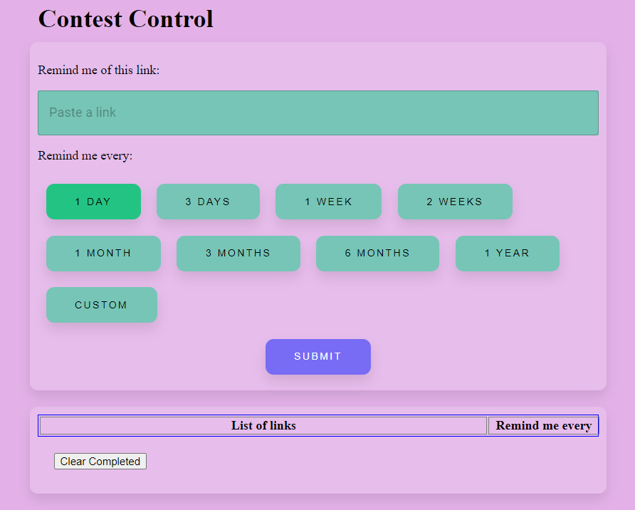
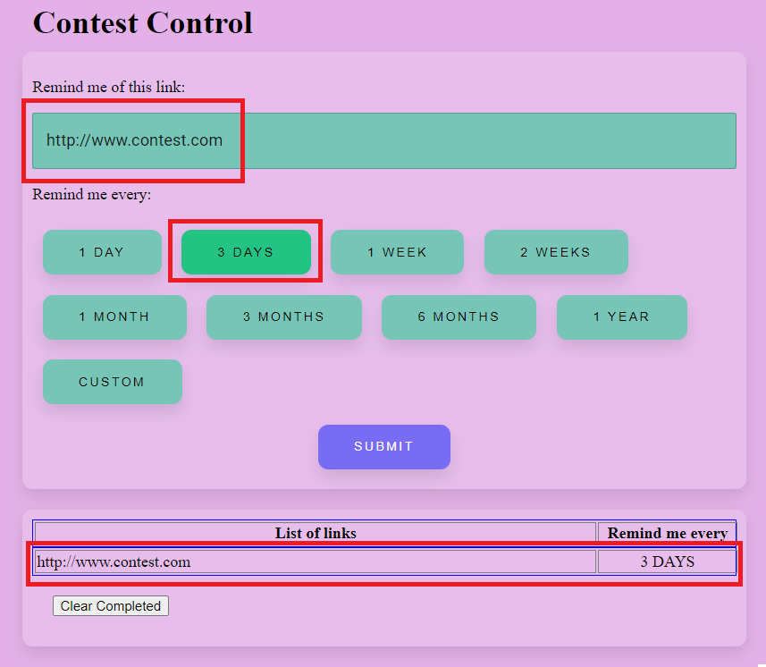
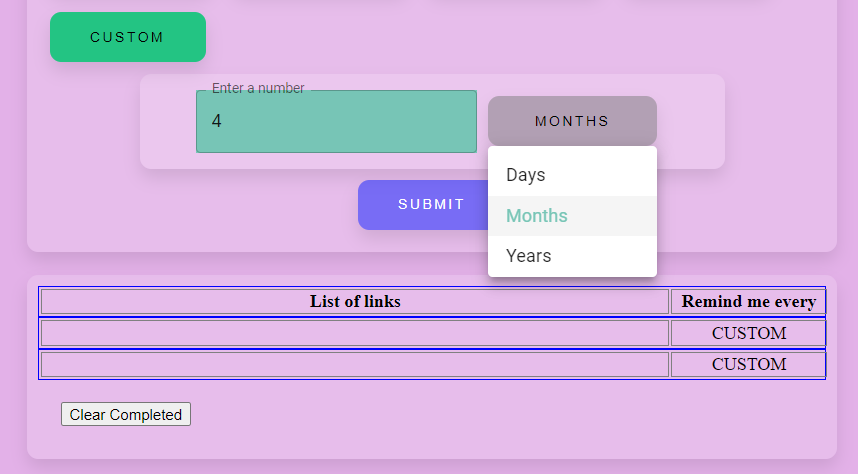

# Contest Control
A contest reminder web application (This application is still a work in progress as of Jan 2023)

## Project Details
I love entering online contests/sweepstakes and some of them have rules stating only one entry per day, week, month etc (or else be disqualified), so I decided to make an application that would remind me of upcoming contests at regular intervals.

The plan is to create an easy-to-use web application that allows users to add and delete contest links to a list in their account.

The application will then send a reminder to the user via Discord and/or email at the specified time.

## What I Have So Far
1. This is the main page.

  
  <h3 align="center">Contest Control main page designed with React, SCSS, and Material UI</h3>

 

2. * The user will paste the contest URL into the text field and select a time interval. After clicking "SUBMIT", the link and time interval will be displayed in a table.
    * To be implemented: A non-visible timer will start to repeatedly count down from the time interval selected. When the time is up, a notification will be sent to the user.
    * The "Clear Completed" is working. The user needs to click on the row that they would like to delete and it is removed from the list.

  
  <h3 align="center">Paste a link, select a time interval, and see it displayed after clicking SUBMIT</h3>

 

3. There is also an option to select a custom time interval. This is also a work in progress.

  
  <h3 align="center">Inputting a custom time interval</h3>

## Next steps
* Login functionality
* Set up database to record each user
* Custom time interval functionality
* Connect to Discord and/or email services
* Better colour scheme (😅)